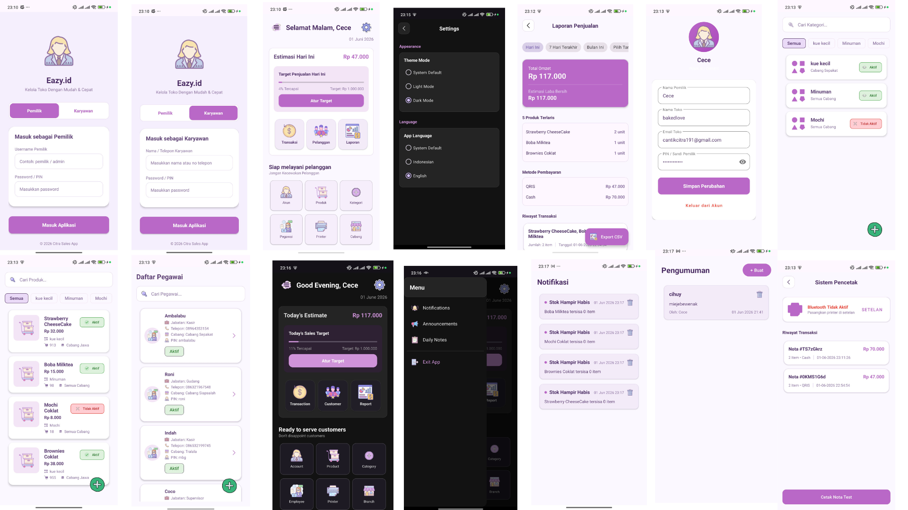
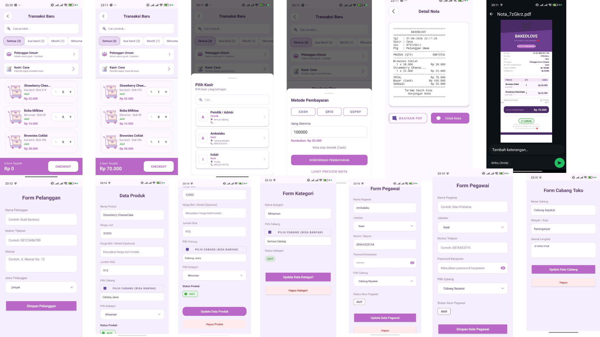
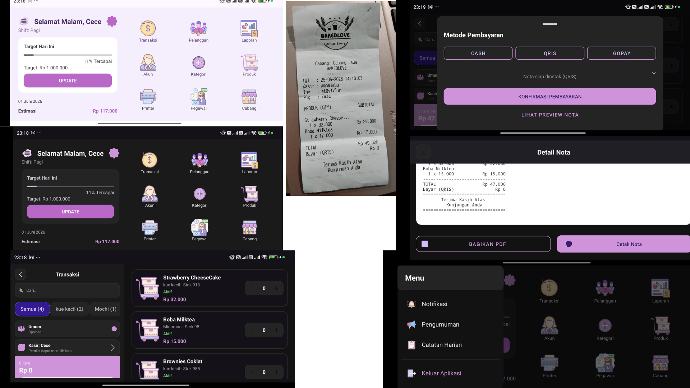

# Eazy.id - Sistem Point of Sale

Aplikasi Point of Sale (POS) komprehensif yang dibangun dengan Android dan Firebase Realtime Database untuk mengelola penjualan, inventaris, pelanggan, karyawan, dan operasi bisnis.


## 🌟 Fitur

### 🔐 Autentikasi & Manajemen Pengguna
- **Role-Based Access Control (RBAC)**
  - **Pemilik**: Akses penuh ke semua fitur
  - **Admin**: Kelola produk, kategori, karyawan, cabang, pengumuman
  - **Supervisor**: Akses view-only untuk produk dan kategori
  - **Kasir**: Proses transaksi, kelola pelanggan
  - **Gudang**: Kelola produk dan kategori
- **Sistem Login Aman** dengan persistensi sesi
- **Multi-cabang** - Setiap pengguna dapat ditugaskan ke cabang tertentu
- **Manajemen Karyawan** - Tambah, edit, dan kelola staf

### 💳 Manajemen Transaksi
- **Pemrosesan Penjualan Real-time**
- **Metode Pembayaran Beragam** - Tunai, QRIS, Transfer, Kredit
- **Pencarian Produk** - Cepat berdasarkan nama atau barcode
- **Manajemen Keranjang** - Tambah, hapus, dan modifikasi item
- **Perhitungan Pajak Otomatis**
- **Perhitungan Kembalian**
- **Riwayat Transaksi** - Lihat transaksi masa lalu
- **Generasi Struk** - Buat struk PDF dengan branding kustom

### 📦 Manajemen Inventaris
- **Manajemen Produk**
  - Tambah, edit, hapus produk
  - Set harga, stok, dan kategori
  - Tugaskan produk ke cabang
  - Peringatan stok rendah (notifikasi otomatis)
- **Manajemen Kategori**
  - Organisir produk ke dalam kategori
  - Kategori spesifik cabang
- **Pelacakan Stok**
  - Update stok real-time
  - Pengurangan stok otomatis setelah penjualan
  - Monitoring level stok

### 👥 Manajemen Pelanggan
- **Database Pelanggan**
  - Tambah dan kelola informasi pelanggan
  - Riwayat pembelian pelanggan
  - Manajemen informasi kontak
- **Seleksi Pelanggan Cepat** untuk transaksi

### 🏢 Manajemen Cabang
- **Multi-cabang**
  - Buat dan kelola beberapa cabang toko
  - Inventaris spesifik cabang
  - Karyawan spesifik cabang
  - Pengumuman dan catatan spesifik cabang
- **Pelacakan Lokasi Cabang**

### 📊 Dashboard & Analitik
- **Dashboard Penjualan**
  - Estimasi penjualan harian
  - Pelacakan target penjualan
  - Tampilan persentase pencapaian
  - Update penjualan real-time
- **Pengaturan Target Penjualan** - Set target penjualan harian
- **Monitoring Kinerja**

### 🔔 Notifikasi & Komunikasi
- **Peringatan Stok Rendah** - Notifikasi otomatis saat stok rendah
- **Pengumuman** - Pemilik dan admin dapat buat pengumuman untuk semua cabang
- **Catatan Harian** - Semua pengguna dapat buat dan bagikan catatan harian
- **Fitur Hapus** - Pengguna dapat hapus notifikasi, pengumuman, dan catatan

### 🖨️ Printing & Struk
- **Generasi Struk PDF**
  - Desain struk kustom
  - Branding toko
  - Detail transaksi
  - Daftar produk dengan kuantitas dan harga
  - Metode pembayaran dan kembalian
- **Dukungan Printer**
  - Integrasi printer Bluetooth
  - Dukungan printer thermal
  - Format struk yang dapat dikustomisasi

### 🌐 Lokalisasi
- **Multi-bahasa**
  - Indonesia (Bahasa Indonesia)
  - Inggris
  - Penggantian bahasa di pengaturan
  - Semua elemen UI diterjemahkan

### 🎨 Tema & UI
- **Opsi Tema**
  - Mode Terang
  - Mode Gelap
  - Default Sistem (ikuti tema perangkat)
- **Material Design Modern**
  - Antarmuka bersih dan intuitif
  - Layout responsif
  - Dukungan portrait dan landscape
- **Ikon Kustom** - Set ikon cantik untuk semua fitur

### ⏰ Fitur Cerdas
- **Sapaan Berbasis Waktu**
  - Selamat Pagi (00:00 - 11:59)
  - Selamat Siang (12:00 - 17:59)
  - Selamat Malam (18:00 - 23:59)
- **Deteksi Waktu Otomatis** berdasarkan lokasi perangkat

### 📱 Antarmuka Pengguna

#### Mode Portrait



Mode portrait memiliki:
- **Dashboard Utama** dengan estimasi penjualan dan pelacakan target
- **Menu Akses Cepat** untuk semua fitur utama
- **Navigasi Sidebar** dengan notifikasi, pengumuman, dan catatan harian
- **Layar Transaksi** dengan pencarian produk dan keranjang
- **Manajemen Produk** dengan filter kategori
- **Manajemen Pelanggan** dengan tambah cepat
- **Manajemen Karyawan** dengan penetapan role
- **Manajemen Cabang** dengan pelacakan lokasi
- **Pengaturan** untuk tema dan bahasa

#### Mode Landscape


Mode landscape menyediakan:
- **Layout Teroptimasi** untuk tablet dan perangkat landscape
- **Tampilan Split-screen** untuk produktivitas lebih baik
- **Dashboard Ditingkatkan** dengan informasi lebih detail
- **Akses Fitur Penuh** dalam orientasi landscape

## 🛠️ Teknologi

- **Bahasa**: Kotlin
- **Platform**: Android
- **Backend**: Firebase Realtime Database
- **UI Framework**: Material Design Components
- **Generasi PDF**: Custom PDF library
- **Integrasi Printer**: Dukungan printer Bluetooth/USB

## 🚀 Instalasi

1. Clone repository
```bash
git clone https://github.com/yourusername/penjualan.git
```

2. Buka di Android Studio
3. Sinkronkan file Gradle
4. Tambah konfigurasi Firebase Anda (`google-services.json`)
5. Build dan jalankan aplikasi

## 📝 Konfigurasi

### Setup Firebase
1. Buat proyek Firebase
2. Tambah aplikasi Android dengan package name `com.citra.penjualan`
3. Download `google-services.json` dan tempatkan di folder `app/`
4. Aktifkan Realtime Database
5. Atur aturan autentikasi

### Struktur Database
```
penjualan/
├── produk/           # Inventaris produk
├── kategori/         # Kategori produk
├── pelanggan/        # Database pelanggan
├── pegawai/          # Manajemen karyawan
├── cabang/           # Informasi cabang
├── transaksi/        # Record transaksi
├── profil/           # Profil toko
├── settings/         # Pengaturan aplikasi
├── notifikasi/       # Peringatan stok
├── pengumuman/       # Pengumuman
└── catatan_harian/   # Catatan harian
```

## 👥 Role & Izin Pengguna

| Role | Produk | Kategori | Transaksi | Pelanggan | Karyawan | Cabang | Laporan | Pengaturan |
|------|--------|----------|-----------|-----------|-----------|---------|---------|------------|
| Pemilik | Penuh | Penuh | Lihat | Penuh | Penuh | Penuh | Penuh | Penuh |
| Admin | Penuh | Penuh | Lihat | Penuh | Penuh | Penuh | Penuh | - |
| Supervisor | Lihat | Lihat | - | Penuh | - | - | Penuh | - |
| Kasir | Lihat | Lihat | Penuh | Penuh | - | - | - | - |
| Gudang | Penuh | Penuh | - | - | - | - | - | - |

## 📸 Screenshot

### Fitur Utama
- **Layar Login** - Autentikasi aman dengan deteksi role
- **Dashboard** - Overview penjualan dengan pelacakan target
- **Transaksi** - Seleksi produk dan checkout mudah
- **Manajemen Produk** - Kontrol inventaris lengkap
- **Manajemen Pelanggan** - Database pelanggan
- **Manajemen Karyawan** - Manajemen staf
- **Manajemen Cabang** - Dukungan multi-cabang
- **Pengaturan** - Kustomisasi tema dan bahasa

### Fitur Khusus
- **Notifikasi** - Peringatan stok rendah
- **Pengumuman** - Pengumuman seluruh perusahaan
- **Catatan Harian** - Komunikasi tim
- **Preview Struk** - Generasi struk PDF
- **Setup Printer** - Konfigurasi printer

## 🔒 Keamanan

- Firebase Authentication
- Role-based access control
- Manajemen sesi aman
- Enkripsi data saat transit
- Isolasi data level cabang

## 📊 Manajemen Data

- **Sinkronisasi Real-time** - Semua data disinkronkan secara real-time
- **Dukungan Offline** - Fungsionalitas offline dasar
- **Backup Cloud** - Backup otomatis ke Firebase
- **Ekspor Data** - Ekspor data transaksi

## 🎯 Peningkatan Masa Depan

- [ ] Pelacakan pengeluaran
- [ ] Pelaporan lanjutan dengan grafik
- [ ] Integrasi scanning barcode
- [ ] Program loyalitas
- [ ] Dukungan multi-mata uang
- [ ] Integrasi pembayaran online
- [ ] Peramalan inventaris
- [ ] Penjadwalan karyawan
- [ ] Aplikasi mobile untuk pelanggan

## 🤝 Kontribusi

Kontribusi diterima! Silakan kirim Pull Request.

## 📄 Lisensi

Proyek ini adalah software proprietary. Semua hak dilindungi.

## 👨‍💻 Developer

Dikembangkan dengan ❤️ untuk Eazy.id

## 📞 Dukungan

Untuk dukungan dan pertanyaan, silakan hubungi tim pengembangan.

---

**Versi**: 1.0.0  
**Terakhir Diperbarui**: 2026  
**Platform**: Android 5.0+  
**Minimum SDK**: 21  
**Target SDK**: 33
